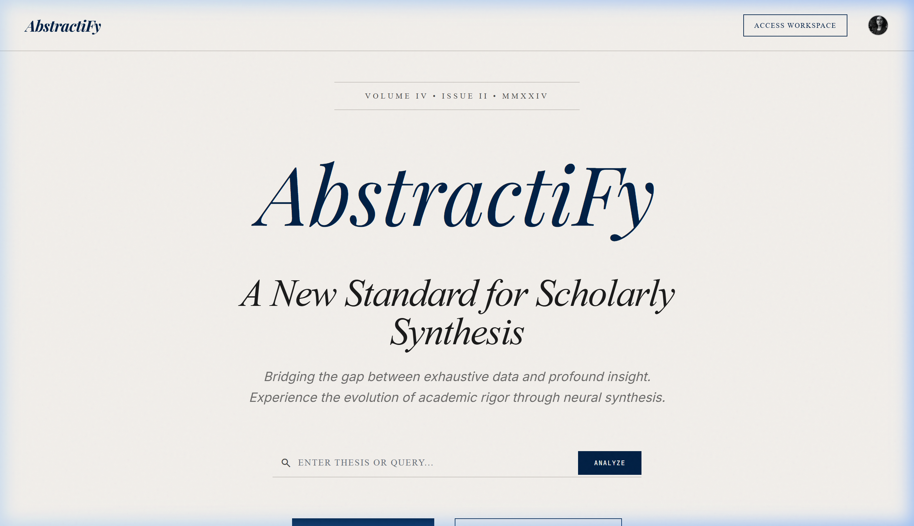
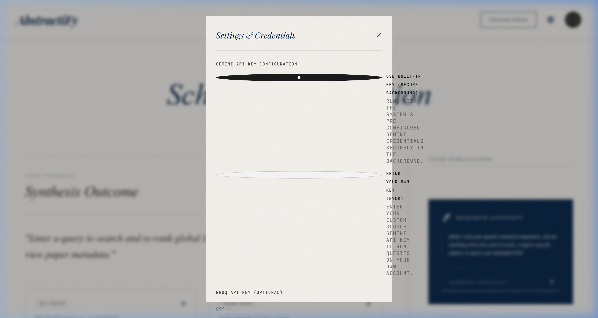
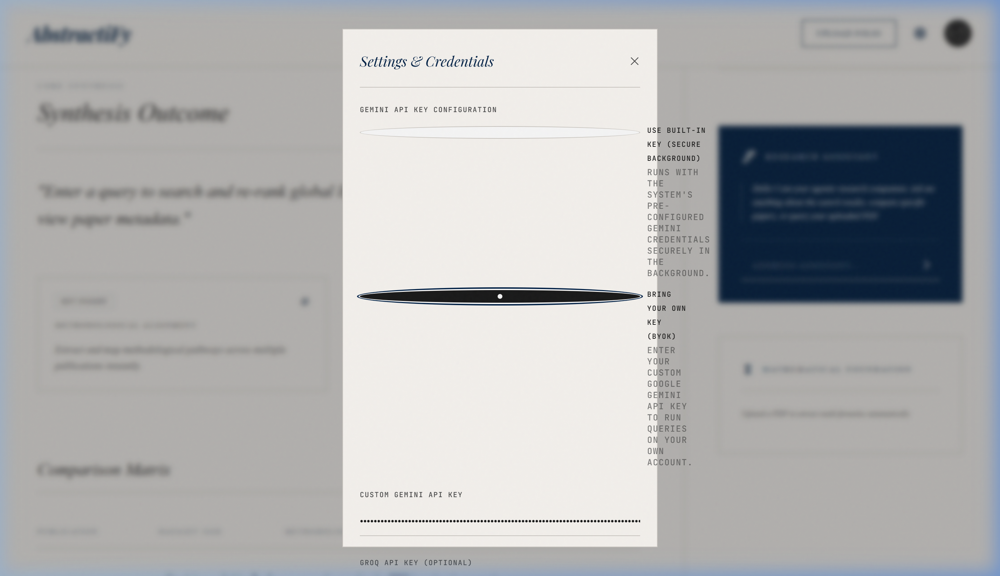
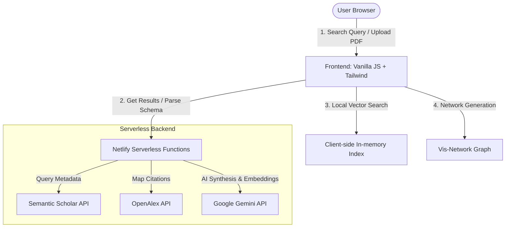

# 🎓 AbstractiFy: Academic AI Synthesis Portal

> **De-jargonize research. Find consensus. Map the science.**

AbstractiFy is a premium, lightweight, and frictionless academic search and synthesis portal. It transitions research exploration from static paper lists to an interactive, multi-dimensional, consensus-driven intelligence suite. By utilizing open-access academic APIs combined with state-of-the-art LLMs, AbstractiFy allows researchers, graduate students, and developers to explore scientific literature at zero cost.

---

## 📸 Application Screenshots

### 🏛️ Landing Page


### ⚙️ Secure Credentials Settings Drawer
| Mode 1: Secure Background Key | Mode 2: Bring Your Own Key (BYOK) |
| :---: | :---: |
|  |  |

---

## ✨ Key Features

1. **🔍 Hybrid Semantic Search & Global Ingestion**
   * Dynamically queries **Semantic Scholar** and **OpenAlex** APIs across 200M+ publications.
   * Performs real-time L2-normalized vector similarity re-ranking using local text embeddings.

2. **📊 The Consensus Meter**
   * Classifies findings from the top relevant papers on a query assertion (e.g., *"Does physical exercise decrease beta-amyloid accumulation?"*).
   * Visualizes support vs. contradiction balances with a clean percentage progress bar and synthesizes a brief 150-word overview of the current scientific consensus.

3. **🧮 Study Comparison Matrix**
   * Auto-extracts design parameters, core methodologies, primary outcomes, and limitations using structured JSON generation (Gemini schema parsing).
   * Renders findings in an interactive spreadsheet format with one-click **CSV export**.

4. **🕸️ Interactive Citation Network Graph**
   * Visualizes reference and citation lineages up to 2 degrees of depth using **NetworkX** and **Pyvis**.
   * Physics-stabilized, draggable HTML/JS network representations that color-code papers by publication year and scale nodes proportionally to citation count.

5. **💬 Reading Assistant & Equation Explainer**
   * Allows uploading academic PDFs, performing local chunking, and index mapping.
   * Features a regex-based parser that identifies LaTeX math equations (`$`/`$$`) and runs a structured breakdown to explain variables and mathematical logic using simple analogies.

6. **🔒 Flexible Credentials Management**
   * **Secure Background Mode**: Runs with pre-configured server-side keys without exposing secrets to the client.
   * **Bring Your Own Key (BYOK) Mode**: Allows developers to input their custom Gemini API keys securely in the frontend settings panel.

---

## 🏗️ System Architecture



---

## 📂 Project Structure

```
Abstractify/
├── docs/                               # Project Documentation
│   ├── AbstractiFy PRD.pdf             # Product Requirement Document
│   └── AbstractiFy Anti-Gravity...pdf  # Features Checklist
├── netlify/                            # Netlify Serverless Backend
│   └── functions/                      # Endpoint Handlers
│       ├── _utils.ts                   # API & Verification Utilities
│       ├── search.ts                   # Academic Search & Re-ranking
│       ├── consensus.ts                # Consensus Meter Classification
│       ├── compare.ts                  # Study Comparison Matrix Extraction
│       ├── citation-context.ts         # Smart Citation Intents API
│       ├── network-graph.ts            # Network Citation Builder
│       ├── pdf-upload.ts               # Local PDF Chunking Handler
│       ├── pdf-chat.ts                 # PDF In-Document Vector Chat
│       └── pdf-explain-math.ts         # Inline LaTeX Math Explainer
├── public/                             # Premium Web Frontend
│   ├── index.html                      # Layout & Editorial Theme
│   ├── styles.css                      # Custom Card & Modal Styling
│   ├── app.js                          # Client-side Core Controller
│   └── screenshots/                    # App Visuals & Assets
├── research/                           # Prototypes & Notebooks
│   └── Coding_Blocks_Research...ipynb  # Original Jupyter Prototype
├── .gitignore                          # Exclusions List
├── netlify.toml                        # Serverless Build Config
├── package.json                        # Node Dependencies
└── tsconfig.json                       # TypeScript Compiler Options
```

---

## ⚙️ Local Installation & Development

### Prerequisites
* [Node.js](https://nodejs.org/) (v18+)
* Netlify CLI (`npm install -g netlify-cli`)

### Setup Instructions

1. **Clone the Repository**
   ```bash
   git clone https://github.com/vansh7nvc/Abstractify.git
   cd Abstractify
   ```

2. **Install Dependencies**
   ```bash
   npm install
   ```

3. **Configure Environment Variables**
   Create a `.env` file in the root directory:
   ```env
   GEMINI_API_KEY=your_gemini_api_key_here
   ```

4. **Run the Development Server**
   Start the local Netlify environment:
   ```bash
   netlify dev
   ```
   Open your browser and navigate to `http://localhost:8888`.

---

## 🌐 Production Deployment

Deploy to Netlify in a single command:
```bash
netlify deploy --prod
```

Make sure to configure the `GEMINI_API_KEY` inside your **Netlify Site Settings** (`Site configuration > Environment variables`) so serverless functions can access the model in production securely without exposing the key on the client!
