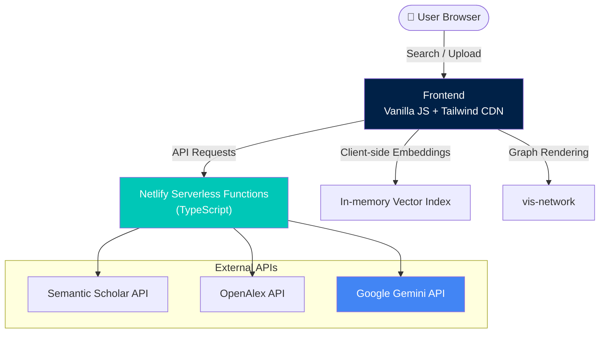

# 🎓 AbstractiFy

> **De-jargonize research. Find consensus. Map the science.**

[](https://abstractify1.netlify.app)
[](LICENSE)


### 🎬 Demo

<!-- Replace the link below with your recorded demo GIF or video -->
<!--  -->

> 📹 *Demo video coming soon — record a 60-second walkthrough using [ScreenToGif](https://www.screentogif.com/), [Loom](https://www.loom.com/), or OBS and save it as `public/screenshots/demo.gif`.*

---

> **AbstractiFy** is a premium, zero-cost academic search and synthesis portal that transforms research exploration from static paper lists into an interactive, consensus-driven intelligence suite. Powered by open-access academic APIs and Google Gemini, it enables researchers, graduate students, and developers to explore 200M+ publications with semantic understanding.

---

## 📸 Screenshots

### 🏛️ Landing Page


### ⚙️ Credentials Settings — BYOK Mode


---

## ✨ Features

### 🔍 Hybrid Semantic Search & Global Ingestion
Dynamically queries **Semantic Scholar** and **OpenAlex** APIs across 200M+ publications. Performs real-time L2-normalized vector similarity re-ranking using local text embeddings from Google Gemini.

### 📊 The Consensus Meter
Classifies findings from the top relevant papers on a query assertion (e.g., *"Does physical exercise decrease beta-amyloid accumulation?"*). Visualises support vs. contradiction balances with a clean percentage progress bar and synthesises a brief 150-word overview of the current scientific consensus.

### 🧮 Study Comparison Matrix
Auto-extracts design parameters, core methodologies, primary outcomes, and limitations using structured JSON generation (Gemini schema parsing). Renders findings in an interactive spreadsheet format with one-click **CSV export**.

### 🕸️ Interactive Citation Network Graph
Visualises reference and citation lineages up to 2 degrees of depth using **vis-network**. Physics-stabilised, draggable HTML/JS network representations that colour-code papers by publication year and scale nodes proportionally to citation count.

### 💬 Reading Assistant & Equation Explainer
Upload academic PDFs, perform local chunking and index mapping. A regex-based parser identifies LaTeX math equations (`$`/`$$`) and runs a structured breakdown to explain variables and mathematical logic using simple analogies.

### 🔗 Smart Citation Context
Analyses how a paper is cited by others — classifying citation intent (supports, contradicts, extends, methodological) and extracting surrounding context for deeper understanding.

### 🔒 Flexible Credentials Management
- **Secure Background Mode**: Runs with pre-configured server-side keys without exposing secrets to the client.
- **Bring Your Own Key (BYOK)**: Input your custom Gemini API key securely in the frontend settings panel.

---

## 🏗️ Architecture



---

## 📂 Project Structure

```
Abstractify/
├── public/                             # Frontend (served as static files)
│   ├── index.html                      # Landing page + workspace UI
│   ├── app.js                          # Client-side controller (~34KB)
│   ├── styles.css                      # Custom styling
│   └── screenshots/                    # App screenshots
│
├── netlify/functions/                  # Serverless API layer (TypeScript)
│   ├── _utils.ts                       # Shared: API keys, Gemini client, types
│   ├── search.ts                       # Hybrid semantic search + re-ranking
│   ├── consensus.ts                    # Consensus Meter classification
│   ├── compare.ts                      # Study Comparison Matrix extraction
│   ├── citation-context.ts            # Smart citation intent analysis
│   ├── network-graph.ts               # Citation network builder
│   ├── pdf-upload.ts                   # PDF chunking handler
│   ├── pdf-chat.ts                     # In-document vector chat (RAG)
│   └── pdf-explain-math.ts            # LaTeX equation explainer
│
├── docs/                               # PRD & feature checklist
├── research/                           # Jupyter prototype notebook
│
├── .eslintrc.json                      # ESLint config
├── .prettierrc                         # Prettier config
├── .gitattributes                      # GitHub language detection
├── .env.example                        # Environment variable template
├── LICENSE                             # MIT License
├── netlify.toml                        # Build config + security headers
├── package.json                        # Dependencies & scripts
└── tsconfig.json                       # TypeScript compiler options
```

---

## ⚙️ Quick Start

### Prerequisites

- [Node.js](https://nodejs.org/) v18+
- [Netlify CLI](https://docs.netlify.com/cli/get-started/) (`npm install -g netlify-cli`)
- A [Google Gemini API key](https://aistudio.google.com/app/apikey)

### Setup

```bash
# 1. Clone the repository
git clone https://github.com/vansh7nvc/Abstractify.git
cd Abstractify

# 2. Install dependencies
npm install

# 3. Configure environment
cp .env.example .env
# Edit .env and add your GEMINI_API_KEY

# 4. Start the dev server
netlify dev

# 5. Open http://localhost:8888
```

### Available Scripts

| Command | Description |
|---|---|
| `npm run dev` | Start local Netlify dev server |
| `npm run lint` | Run ESLint on serverless functions |
| `npm run lint:fix` | Auto-fix ESLint issues |
| `npm run format` | Format code with Prettier |
| `npm run format:check` | Check formatting without writing |
| `npm run typecheck` | TypeScript type checking |

---

## 🌐 Deployment

Deploy to Netlify in a single command:

```bash
netlify deploy --prod
```

> [!IMPORTANT]
> Configure `GEMINI_API_KEY` in **Netlify Site Settings** → **Environment variables** so serverless functions can access the model in production without exposing the key on the client.

---

## 🛡️ Security

- **Security headers** enforced via `netlify.toml` (`X-Frame-Options`, `X-Content-Type-Options`, `Referrer-Policy`, `Permissions-Policy`)
- **No client-side API key exposure** in Secure Background Mode
- **BYOK keys** are sent via headers, never persisted server-side

---

## 📄 License

This project is licensed under the [MIT License](LICENSE).

**Copyright © 2026 Vansh Sharma**
