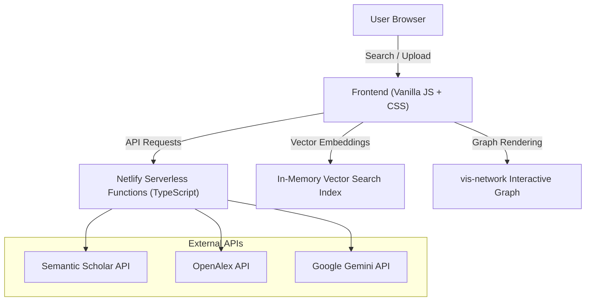

# 🏗️ AbstractiFy System Architecture

AbstractiFy is designed around a high-performance decoupled architecture: static client-side rendering paired with event-driven serverless functions.

---

## 📐 System Architecture Diagram

---

## 🔍 Core Pipeline Subsystems

### 1. Hybrid Search & Vector Re-Ranking
- **Global Data Retrieval**: Simultaneously queries Semantic Scholar and OpenAlex APIs across 200M+ publications.
- **L2 Vector Embeddings**: Calls Google Gemini (`text-embedding-004`) to compute dense vector embeddings for query assertions and paper abstracts.
- **Cosine Similarity Re-Ranking**: Performs client-side L2 vector dot-product scoring to re-rank papers by semantic relevance.

---

### 2. The Consensus Meter Engine
- **Stance Classification**: Evaluates paper findings on an assertion query using structured Gemini classification (`SUPPORT`, `CONTRADICT`, `NEUTRAL`).
- **Synthesis Generation**: Computes support-to-contradiction percentages and synthesises a brief 150-word executive summary of scientific consensus.

---

### 3. Study Comparison Matrix Engine
- **Structured JSON Schema Parsing**: Extracts methodology, sample size, primary findings, and limitations from papers using Gemini JSON mode (`responseMimeType: application/json`).
- **Interactive Spreadsheet & CSV Export**: Renders extracted parameters in a comparison grid with instant CSV and Markdown table downloads.

---

### 4. Citation Network Graph Subsystem
- **Lineage Extraction**: Fetches references and citations up to 2 degrees of depth.
- **Vis-Network Physics Engine**: Renders interactive, physics-stabilised network graphs that scale nodes proportionally to citation counts and colour-code by publication year.
